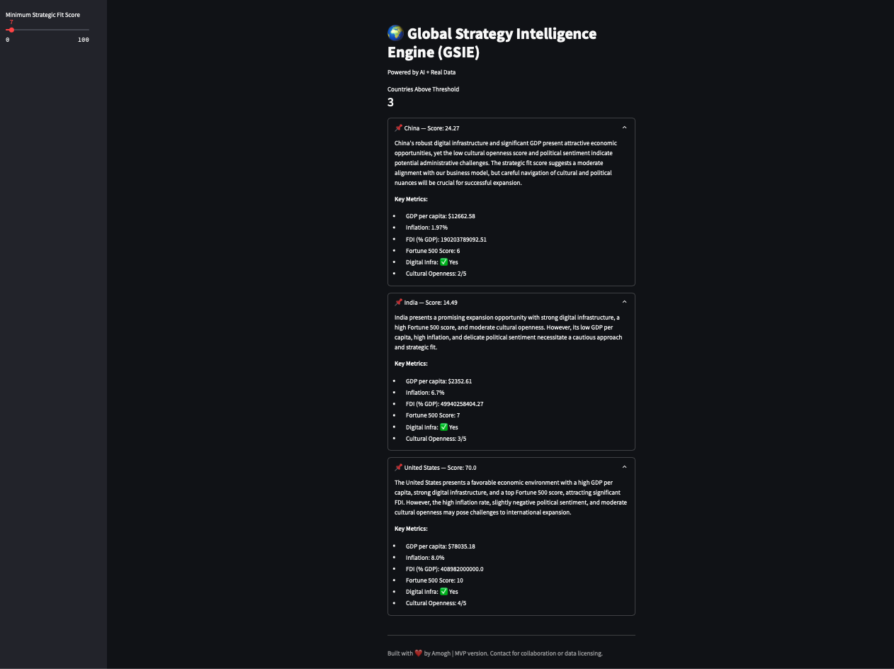

# 🌍 Global Strategy Intelligence Engine (GSIE)

> ⚡ Built by Amogh Shashank Mannava  
> 📌 AI-powered country evaluation using real data & global strategy models  
> 📊 Streamlit Dashboard | OpenAI Summaries | World Bank Analytics

---

## 📖 What Is GSIE?

**GSIE** is a decision-support tool that helps international business strategists identify the best countries for expansion.

It blends real-world **economic indicators**, **sentiment analysis**, and **AI-generated strategic insights** using the **CAGE framework** — all scored into a custom **Strategic Fit Score**.

---

## 🧠 Key Features

✅ Real-time economic data (GDP, FDI, inflation)  
✅ Sentiment analysis using NLP  
✅ Strategic scoring system  
✅ AI-generated summaries with CAGE model  
✅ Interactive dashboard built in Streamlit

---

## 🧪 Tech Stack

- **Python 3.12+**
- **Pandas, NumPy, scikit-learn**
- **OpenAI API (GPT-4)**
- **World Bank API**
- **Streamlit** (for visualization)

---

## 📊 Sample Dashboard

| Full View | Score-Filtered |
|-----------|----------------|
|  | *(more coming soon)* |

---

## ⚙️ Setup Instructions

### 1. Clone the repo

```bash
git clone https://github.com/amoghshashank/gsie.git
cd gsie
2. Create & activate a virtual environment
bash
Copy
Edit
python3 -m venv venv
source venv/bin/activate
3. Install dependencies
bash
Copy
Edit
pip install -r requirements.txt
4. Set your OpenAI key
bash
Copy
Edit
export OPENAI_API_KEY=your_key_here
5. Run the dashboard
bash
Copy
Edit
streamlit run gsie_dashboard.py
📁 Project Structure
Copy
Edit
├── gdp_fetch.py
├── indicator_fetch.py
├── merge_and_cluster.py
├── strategic_score_builder.py
├── generate_cage_notes.py
├── news_sentiment.py
├── gsie_dashboard.py
├── final_strategic_dataset.csv
├── requirements.txt
├── .gitignore
└── README.md
📌 Future Plans
Expand to 100+ countries dynamically

Add diaspora + talent pool scoring

Integrate UPI, eGov readiness, and startup index metrics

API-as-a-service version (in development)

🤝 Collaborate / Support
If you're in global strategy, policy, or economic consulting, this tool was made for you.

Feel free to fork, star, or message me for:

Custom deployments

Research collaboration

Adding features / scaling

📧 amoghshashank@gmail.com
🔗 LinkedIn

🪪 License
This project is licensed under the MIT License — see the LICENSE file for details.

yaml
Copy
Edit

---

### ✅ Next Step:
Copy this into your `README.md` locally:

```bash
nano README.md